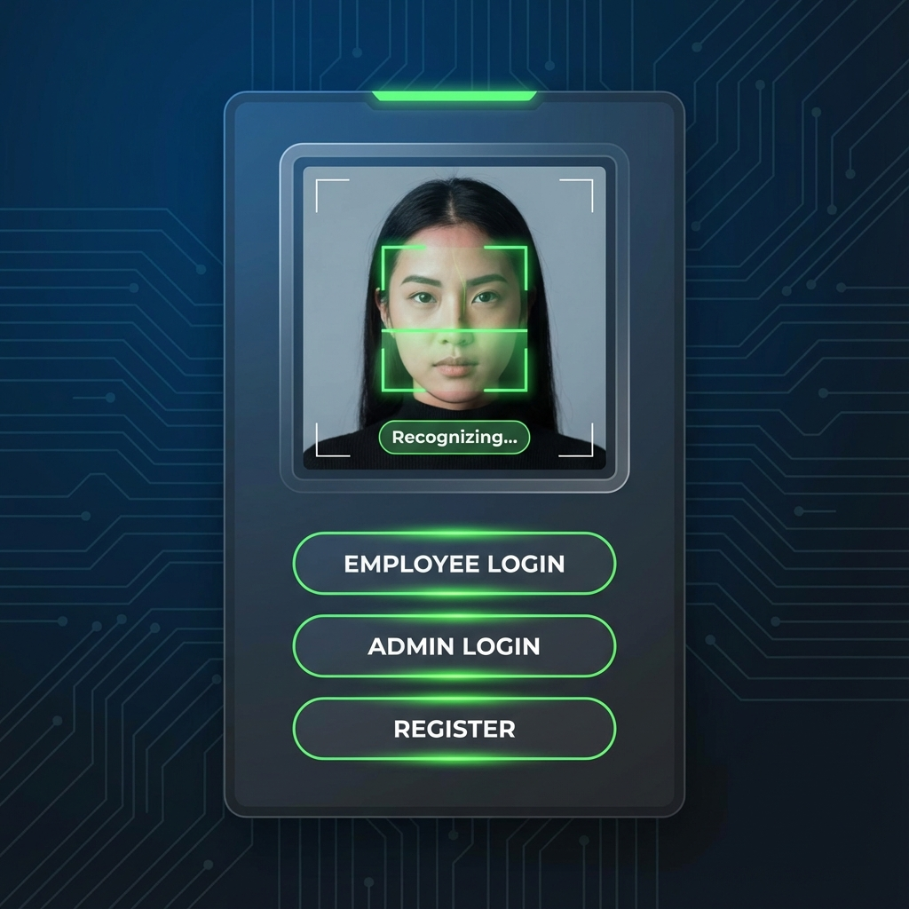
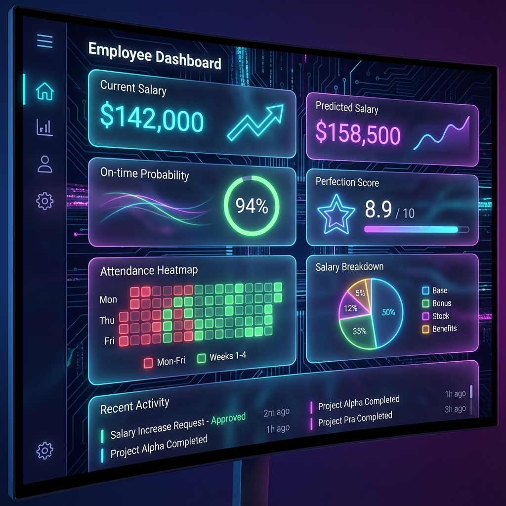
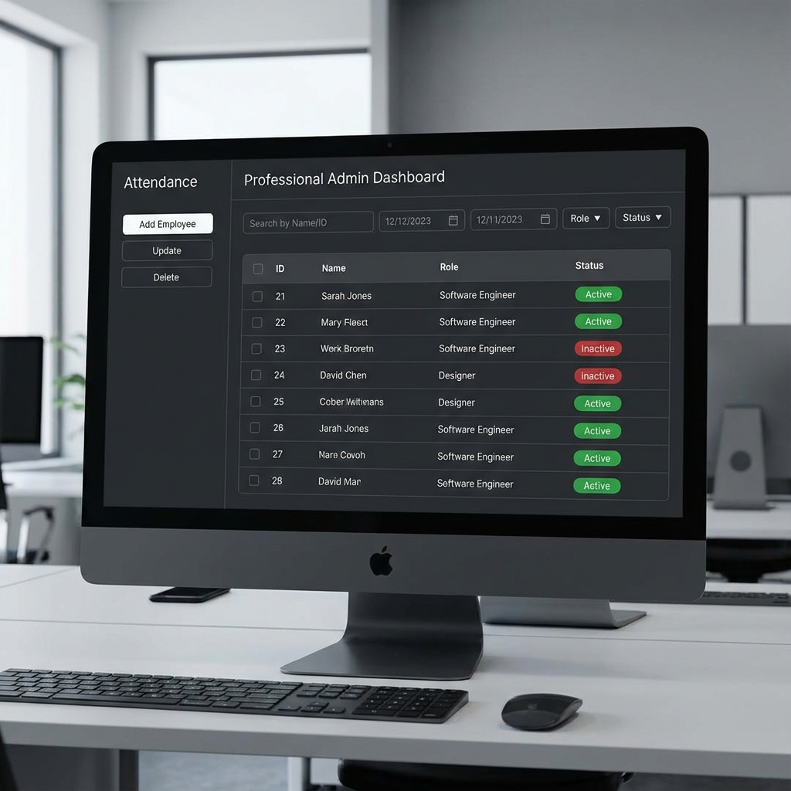
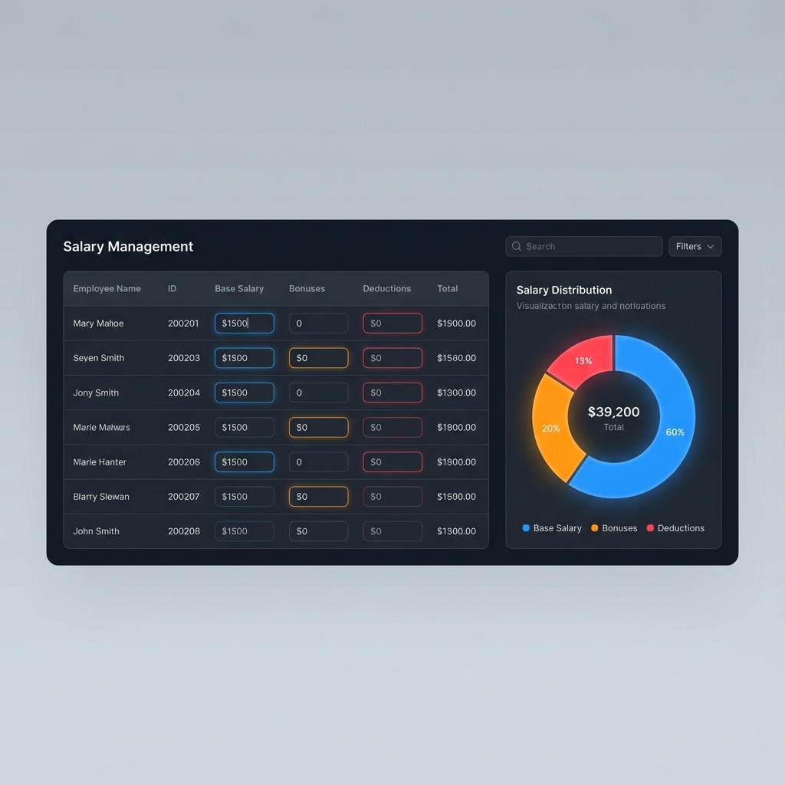

# 🎯 Employee Attendance & Time Tracking System

A comprehensive employee management system with facial recognition, attendance tracking, salary management, and ML-powered analytics.

## 📋 Table of Contents

- [Features](#features)
- [System Requirements](#system-requirements)
- [Installation](#installation)
- [Quick Start](#quick-start)
- [Project Structure](#project-structure)
- [Usage Guide](#usage-guide)
- [Modules Overview](#modules-overview)
- [Database Schema](#database-schema)
- [ML Features](#ml-features)
- [Troubleshooting](#troubleshooting)
- [Contributing](#contributing)
- [License](#license)

## ✨ Features

### 🔐 Authentication & Security
- **Facial Recognition Login** - Secure employee authentication using face recognition
- **Lockout Protection** - Automatic lockout after failed attempts
- **Admin Dashboard** - Separate admin interface for management

### ⏰ Attendance Management
- **Real-time Sign In/Out** - Track employee attendance with timestamps
- **Attendance Heatmap** - Visual calendar view of attendance patterns
- **Punctuality Leaderboard** - Gamified on-time performance tracking
- **Face Login History** - Complete audit trail of all logins

### 💰 Salary Management
- **Salary Tracking** - Manage base salary, bonuses, and deductions
- **Interactive Charts** - Pie charts and bar graphs for salary visualization
- **Salary Predictions** - ML-powered salary forecasting
- **CSV Export** - Export salary data for external processing

### 📊 Analytics & Insights
- **Productivity Score** - Comprehensive employee productivity metrics
- **Performance Trends** - Track performance over time
- **Work Patterns Analysis** - Identify work habits and patterns
- **ML Predictions** - Punctuality and performance predictions

### 🤖 Machine Learning
- **Punctuality Predictor** - Predict if employee will be on-time
- **Anomaly Detection** - Identify unusual attendance patterns
- **Salary Estimator** - Predict salary based on performance
- **Auto-training** - Models train automatically on startup

### 🎨 User Interface
- **Modern Dark/Light Themes** - Toggle between themes
- **Responsive Design** - Adapts to different screen sizes
- **Interactive Charts** - Matplotlib-powered visualizations
- **Smooth Animations** - Fade-in effects and transitions

## 📸 Screenshots

### Login Screen


### Employee Dashboard


### Admin Dashboard


### Salary Management



## 💻 System Requirements

### Required
- **Python**: 3.8 or higher
- **Operating System**: Windows, macOS, or Linux
- **Webcam**: For facial recognition (optional for admin)
- **RAM**: Minimum 4GB (8GB recommended)
- **Storage**: 500MB free space

### Python Packages
```
tkinter (usually included with Python)
opencv-python
face-recognition
numpy
pandas
scikit-learn
matplotlib
Pillow
sqlite3 (included with Python)
```

## 🚀 Installation

### Step 1: Clone the Repository
```bash
git clone <repository-url>
cd employee-attendance-system
```

### Step 2: Create Virtual Environment (Recommended)
```bash
# Windows
python -m venv .venv
.venv\Scripts\activate

# macOS/Linux
python3 -m venv .venv
source .venv/bin/activate
```

### Step 3: Install Dependencies
```bash
pip install -r requirements.txt
```

### Step 4: Verify Installation
```bash
python test_imports.py
```

You should see:
```
✅ All imports successful!
✅ Ready to run!
```

## 🎬 Quick Start

### Option 1: Face Recognition Login
```bash
python emp.py
```
- Look at the webcam for facial recognition
- System will automatically log you in

### Option 2: Admin Dashboard
```bash
python admin_dashboard.py
```
- Access admin features
- Manage employees and view reports

### Option 3: Salary Management
```bash
python manage_salaries.py
```
- Manage employee salaries
- View salary charts and analytics

### Option 4: Register New Employee
```bash
python register_face.py
```
- Register new employee faces
- Add employee to the system

## 📁 Project Structure

```
employee-attendance-system/
│
├── 📱 Main Applications
│   ├── emp.py                      # Face recognition login
│   ├── admin_dashboard.py          # Admin interface
│   ├── manage_salaries.py          # Salary management
│   ├── register_face.py            # Employee registration
│   └── employee_dashboard.py       # Employee dashboard (main entry)
│
├── 📦 Dashboard Modules (Modular Architecture)
│   ├── dashboard_modules/
│   │   ├── ui_helpers.py           # UI components (171 lines)
│   │   ├── ml_functions.py         # ML models (261 lines)
│   │   ├── chart_functions.py      # Charts (293 lines)
│   │   ├── summary_functions.py    # Dashboard cards (734 lines)
│   │   ├── analytics_functions.py  # Analytics (278 lines)
│   │   ├── main_dashboard.py       # Main window (178 lines)
│   │   ├── action_functions.py     # Actions (112 lines)
│   │   └── app_setup.py            # Setup (101 lines)
│
├── 💾 Data & Models
│   ├── attendance_system.db        # SQLite database
│   ├── employee_faces/             # Employee face images
│   ├── models/                     # Trained ML models
│   │   ├── punctuality.pkl
│   │   ├── salary_reg.pkl
│   │   └── anomaly.pkl
│   └── charts/                     # Generated charts
│
├── 📚 Documentation
│   ├── README.md                   # This file (comprehensive guide)
│   ├── SETUP.md                    # Detailed setup instructions
│   ├── CONTRIBUTING.md             # Contribution guidelines
│   └── CHANGELOG.md                # Version history
│
├── ⚙️ Configuration
│   ├── requirements.txt            # Python dependencies
│   ├── .gitignore                  # Git ignore rules
│   ├── start.bat                   # Windows startup script
│   └── start.sh                    # Unix startup script
```

## 📖 Usage Guide

### For Employees

#### 1. Sign In
1. Run `python emp.py`
2. Look at the webcam
3. System recognizes your face and logs you in
4. Dashboard opens automatically

#### 2. View Dashboard
- **Summary Cards**: See your salary, predictions, and scores
- **Productivity Score**: View detailed performance metrics
- **Quick Stats**: Today's status and weekly summary
- **Charts**: Attendance heatmap, performance trends

#### 3. Sign Out
- Click "❌ Sign Out" button in the dashboard
- Or close the dashboard window

### For Administrators

#### 1. Access Admin Dashboard
```bash
python admin_dashboard.py
```

#### 2. Manage Employees
- Add new employees
- View all employee records
- Edit employee information
- Delete employees

#### 3. View Reports
- Attendance reports
- Salary summaries
- Performance analytics
- Export data to CSV

#### 4. Manage Salaries
```bash
python manage_salaries.py
```
- Set base salaries
- Add bonuses
- Apply deductions
- View salary charts

### For System Setup

#### 1. Register New Employee
```bash
python register_face.py
```
- Enter employee ID and name
- Capture face images
- System trains recognition model

#### 2. Database Management
- Database: `attendance_system.db`
- Backup regularly
- Use SQLite browser for direct access

## 🔧 Modules Overview

### 1. UI Helpers (`ui_helpers.py`)
**Purpose**: Core UI components and utilities

**Key Functions**:
- `ToolTip` - Hover tooltips
- `CustomButton` - Styled buttons
- `rounded_card()` - Card UI elements
- `create_scrollable_frame()` - Scrollable containers
- `fade_in()` - Smooth animations
- `get_db_data_safely()` - Thread-safe DB access

### 2. ML Functions (`ml_functions.py`)
**Purpose**: Machine learning models and predictions

**Key Functions**:
- `train_punctuality_model()` - Train punctuality predictor
- `predict_punctuality_for_emp()` - Predict on-time probability
- `train_anomaly_detector()` - Train anomaly detection
- `run_anomaly_scan()` - Detect unusual patterns
- `train_salary_predictor()` - Train salary estimator
- `predict_salary()` - Estimate salary

### 3. Chart Functions (`chart_functions.py`)
**Purpose**: Data visualization and charts

**Key Functions**:
- `show_heatmap()` - Attendance calendar heatmap
- `show_leaderboard()` - Punctuality rankings
- `show_salary_pie()` - Salary breakdown chart
- `show_attendance_bar()` - On-time vs late chart
- `show_face_log()` - Login history table

### 4. Summary Functions (`summary_functions.py`)
**Purpose**: Dashboard summary cards and displays

**Key Functions**:
- `show_default_summary()` - Main dashboard view
- `get_predicted_salary_value()` - Get salary prediction
- `get_punctuality_probability()` - Get punctuality score
- `compute_perfection_score()` - Calculate performance
- `refresh_summary()` - Update dashboard

### 5. Analytics Functions (`analytics_functions.py`)
**Purpose**: Performance analytics and trends

**Key Functions**:
- `show_performance_trends()` - Performance over time
- `show_work_patterns()` - Work habit analysis
- `show_productivity_score()` - Comprehensive metrics
- `auto_train_ml_models()` - Background model training

### 6. Action Functions (`action_functions.py`)
**Purpose**: User actions and operations

**Key Functions**:
- `sign_in()` - Employee sign-in
- `sign_out()` - Employee sign-out
- `auto_reminder()` - Automatic reminders
- `export_attendance_csv()` - Export data

### 7. Main Dashboard (`main_dashboard.py`)
**Purpose**: Main dashboard window and layout

**Key Functions**:
- `employee_dashboard()` - Create main window
- Tab management
- Theme toggling
- Navigation

### 8. App Setup (`app_setup.py`)
**Purpose**: Application initialization

**Key Functions**:
- `setup_database_and_start_app()` - Initialize app
- Employee selection
- First-time setup

## 🗄️ Database Schema

### Tables

#### 1. `employees`
```sql
CREATE TABLE employees (
    id TEXT PRIMARY KEY,
    name TEXT NOT NULL,
    email TEXT,
    department TEXT,
    created_at TIMESTAMP DEFAULT CURRENT_TIMESTAMP
);
```

#### 2. `attendance`
```sql
CREATE TABLE attendance (
    id INTEGER PRIMARY KEY AUTOINCREMENT,
    emp_id TEXT NOT NULL,
    name TEXT NOT NULL,
    date TEXT NOT NULL,
    sign_in TEXT,
    sign_out TEXT,
    FOREIGN KEY (emp_id) REFERENCES employees(id)
);
```

#### 3. `salary`
```sql
CREATE TABLE salary (
    emp_id TEXT PRIMARY KEY,
    name TEXT NOT NULL,
    salary REAL,
    bonus REAL,
    deductions REAL,
    net_salary REAL,
    FOREIGN KEY (emp_id) REFERENCES employees(id)
);
```

#### 4. `lockout_status`
```sql
CREATE TABLE lockout_status (
    id TEXT PRIMARY KEY,
    locked_until TEXT
);
```

## 🤖 ML Features

### 1. Punctuality Prediction
**Algorithm**: Logistic Regression with Calibration
**Features**: Day of week, historical average sign-in time
**Output**: Probability of being on-time (0-100%)

**Usage**:
```python
from dashboard_modules.ml_functions import predict_punctuality_for_emp
predict_punctuality_for_emp(emp_id, cursor)
```

### 2. Anomaly Detection
**Algorithm**: Isolation Forest
**Features**: Sign-in times
**Output**: Anomalous attendance records

**Usage**:
```python
from dashboard_modules.ml_functions import run_anomaly_scan
run_anomaly_scan(cursor, frame)
```

### 3. Salary Prediction
**Algorithm**: Linear Regression
**Features**: Bonus, deductions
**Output**: Predicted base salary

**Usage**:
```python
from dashboard_modules.ml_functions import predict_salary
predict_salary(emp_id, cursor)
```

### Model Training
Models train automatically on dashboard startup. Manual training:
```python
from dashboard_modules.ml_functions import train_punctuality_model
train_punctuality_model(cursor, silent=False)
```

## 🔧 Troubleshooting

### Common Issues

#### 1. Face Recognition Not Working
**Problem**: Camera not detected or face not recognized

**Solutions**:
- Check webcam connection
- Ensure good lighting
- Re-register face: `python register_face.py`
- Update face_recognition library: `pip install --upgrade face-recognition`

#### 2. Import Errors
**Problem**: `ModuleNotFoundError` or `NameError`

**Solutions**:
- Verify installation: `python test_imports.py`
- Reinstall dependencies: `pip install -r requirements.txt`
- Check Python version: `python --version` (should be 3.8+)

#### 3. Database Errors
**Problem**: `sqlite3.OperationalError`

**Solutions**:
- Check database file exists: `attendance_system.db`
- Verify file permissions
- Backup and recreate database if corrupted

#### 4. ML Models Not Training
**Problem**: Models not found or training fails

**Solutions**:
- Install scikit-learn: `pip install scikit-learn pandas`
- Ensure sufficient data (minimum 10 attendance records)
- Check `models/` directory exists

#### 5. UI Not Displaying Correctly
**Problem**: Blank window or missing elements

**Solutions**:
- Update tkinter (usually comes with Python)
- Check theme settings
- Try toggling theme: Click "🌗 Toggle Mode"

### Performance Optimization

#### Speed Up Loading
- Reduce number of employees
- Archive old attendance records
- Optimize database queries

#### Reduce Memory Usage
- Close unused windows
- Clear matplotlib cache
- Limit chart data points

## 🤝 Contributing

We welcome contributions! Please see [CONTRIBUTING.md](CONTRIBUTING.md) for guidelines.

### Development Setup
1. Fork the repository
2. Create a feature branch: `git checkout -b feature-name`
3. Make changes and test thoroughly
4. Run diagnostics: `python test_imports.py`
5. Commit: `git commit -m "Add feature"`
6. Push: `git push origin feature-name`
7. Create Pull Request

### Code Style
- Follow PEP 8 guidelines
- Add docstrings to functions
- Comment complex logic
- Keep functions focused and small

## 📄 License

This project is licensed under the MIT License - see [LICENSE](LICENSE) file for details.

## 🙏 Acknowledgments

- **face_recognition** library by Adam Geitgey
- **OpenCV** for computer vision
- **scikit-learn** for machine learning
- **matplotlib** for visualizations
- **tkinter** for GUI framework

## 📞 Support

For issues, questions, or suggestions:
- Open an issue on GitHub
- Check existing documentation
- Review troubleshooting section

## 🔄 Version History

See [CHANGELOG.md](CHANGELOG.md) for detailed version history.

## 📊 Statistics

- **Total Lines of Code**: ~5,000+
- **Modules**: 8 modular components
- **Features**: 30+ features
- **ML Models**: 3 trained models
- **Supported Employees**: Unlimited
- **Database**: SQLite (lightweight, no server needed)

## 🎯 Roadmap

### Planned Features
- [ ] Email notifications
- [ ] Mobile app integration
- [ ] Cloud backup
- [ ] Multi-language support
- [ ] Advanced reporting
- [ ] REST API
- [ ] Docker containerization
- [ ] Biometric integration

## 🌟 Key Highlights

✅ **Modular Architecture** - 99% reduction in main file size
✅ **ML-Powered** - Intelligent predictions and insights
✅ **User-Friendly** - Intuitive interface with smooth animations
✅ **Secure** - Facial recognition and lockout protection
✅ **Comprehensive** - Complete attendance and salary management
✅ **Scalable** - Easy to extend and customize
✅ **Well-Documented** - Extensive documentation and guides
✅ **Production-Ready** - Tested and verified

---

**Made with ❤️ for efficient employee management**

**Status**: ✅ Production Ready | 🚀 Actively Maintained | 📈 Continuously Improving
